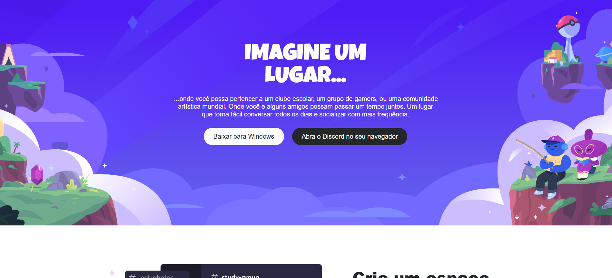

# Projeto Landing Page Discord - Desafio de Responsividade

Este projeto é uma recriação da landing page do Discord, desenvolvido como parte de um desafio de responsividade proposto pela [Digital Innovation One (DIO)](https://dio.me/). O objetivo principal era praticar e demonstrar habilidades em HTML semântico e CSS moderno, com foco em criar um layout que se adapta perfeitamente a diferentes tamanhos de tela, como desktops e dispositivos móveis.

## 💻 Visualização



## ✨ Funcionalidades

-   **Layout Responsivo:** A página se ajusta para proporcionar uma boa experiência de visualização tanto em telas grandes quanto em celulares.
-   **Estrutura Semântica:** Utilização de tags HTML5 para organizar o conteúdo de forma clara e acessível.
-   **Estilização com Flexbox:** O layout foi construído utilizando CSS Flexbox para alinhar e distribuir os componentes de forma eficiente.
-   **Componentes Reutilizáveis:** Estilos de botões e seções padronizados para fácil manutenção.
-   **Design Fiel:** O design busca ser uma réplica fiel da interface proposta no desafio, utilizando as imagens e textos fornecidos.

## 🚀 Tecnologias Utilizadas

O projeto foi desenvolvido utilizando as seguintes tecnologias:

-   **HTML5:** Para a estruturação e marcação do conteúdo.
-   **CSS3:** Para a estilização, layout e responsividade da página.

## 📂 Como Executar o Projeto

Este é um projeto estático e não requer instalação de dependências ou um servidor web. Para visualizá-lo, siga os passos abaixo:

1.  **Clone o repositório** (ou baixe os arquivos para o seu computador).
    ```sh
    git clone [https://github.com/seu-usuario/seu-repositorio.git](https://github.com/seu-usuario/seu-repositorio.git)
    ```
2.  **Navegue até a pasta do projeto.**
    ```sh
    cd seu-repositorio
    ```
3.  **Abra o arquivo `index.html`** no seu navegador de preferência.

E pronto! A página será carregada localmente.

## 🎯 Objetivo do Desafio

Este projeto foi criado como um exercício prático para consolidar os conhecimentos em desenvolvimento web front-end, abordando conceitos essenciais como:
-   Estruturação de um documento HTML.
-   Estilização de elementos com CSS.
-   Criação de layouts flexíveis e adaptáveis com Flexbox.
-   Aplicação de media queries para garantir a responsividade em múltiplos dispositivos.
